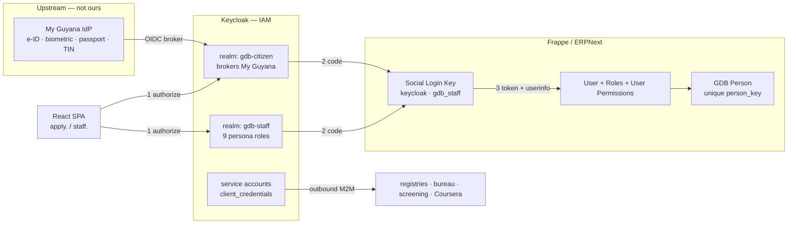
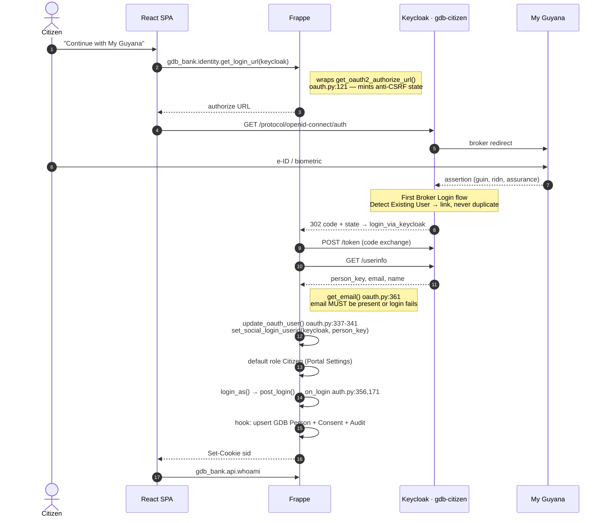
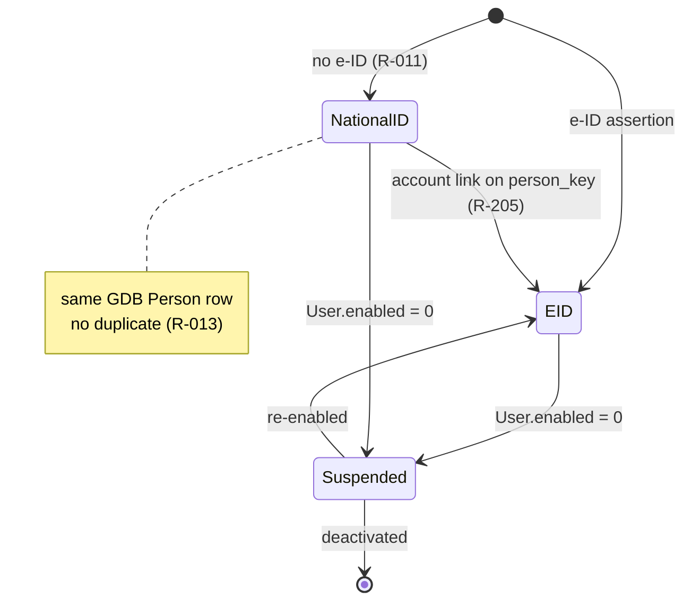
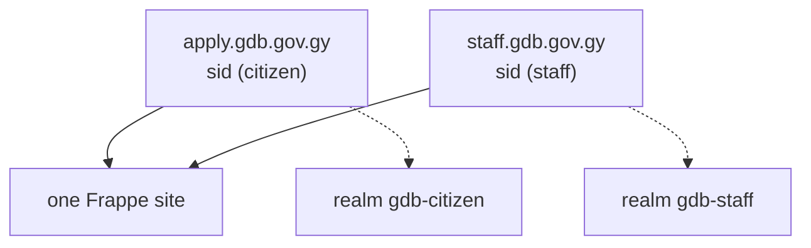

# Identity & Auth — e-ID via Keycloak

Edit the mermaid blocks directly. Verified against frappe `version-16` source (file:line cited).

## 1. Who does what

| Layer | Owns | Does NOT own |
| --- | --- | --- |
| My Guyana (EK Digital) | e-ID, biometric, passport, TIN, identity proofing | anything in aLOS |
| Keycloak | brokering, realms, sessions, claims, roles, service accounts | credit data |
| Frappe | `sid` session, User, roles, permissions, all business data | identity proofing (R-008) |

## 2. Two auth systems — where they meet

- **Keycloak session** — `KEYCLOAK_SESSION` cookie on the Keycloak host. Owns *who you are*.
- **Frappe session** — `sid` cookie on the app host. Owns *what you may do*.
- They meet **once**, at the code exchange. Frappe reads userinfo, mints its own `sid`, and **discards the Keycloak tokens** (social-login path stores no access token).

⚠️ Consequence: two independent lifetimes. Logging out of Keycloak does not kill `sid`. Decide: back-channel logout, or short Frappe session + silent re-auth. Open item.

## 3. Citizen onboarding — first time

Returning sign-in = same flow, steps 8–11 collapse (Keycloak SSO), `update_oauth_user` finds the existing User.

## 4. The three config values that carry the design

| Field | Value | Why |
| --- | --- | --- |
| `user_id_property` | `person_key` | preset ships `preferred_username` (social_login_key.py:238) — mutable, would break R-009/R-206. **Must override.** |
| `auth_url_data.scope` | `openid profile email` | preset ships `openid` only (`:239`) → no email → login hard-fails |
| `redirect_url` | relative path | `get_redirect_uri()` → `frappe.utils.get_url()` (oauth.py:165) resolves per request host → two hostnames work natively. Do not pin `host_name` in site_config. |

`person_key` = Keycloak script mapper emitting `guin ?? ridn`. Never CAN or Document Number (R-010/R-206). Mark it an **essential claim** so a keyless assertion fails auth.

## 5. Identity assurance lifecycle

## 6. Account management

| Action | Where | Note |
| --- | --- | --- |
| Provision citizen | automatic | `sign_ups = Allow` + `Portal Settings.default_role = Citizen` |
| Provision staff | Platform Admin, manually | `sign_ups = Deny` — Keycloak identity alone grants nothing (R-180/R-181) |
| Suspend / deactivate | Frappe `User.enabled = 0` | `update_oauth_user` refuses a disabled user (oauth.py) — single kill switch, works even if Keycloak still authenticates |
| Password reset | n/a | no passwords. `System Settings.disable_user_pass_login = 1`, delete `gdb_bank.api.signup` |
| Consent | `GDB Consent` | versioned text retained (R-012/R-208) |
| Authorization | Frappe | Keycloak roles are the *source*; Frappe Roles + User Permissions + `permission_query_conditions` are the *enforcement* (R-170/R-212) |

## 7. Session separation (R-169/R-211)

`sid` is host-scoped → both contexts active independently. Separate realms → separate SSO sessions.

## 8. Build order

1. `keycloak` service (MariaDB 11.8 — Keycloak's tested version) + realm exports in `keycloak/realms/`
2. Mock OIDC IdP brokered into `gdb-citizen` — unblocks everything while T4 is open
3. `install.py` seeds both Social Login Keys + `Portal Settings.default_role`
4. `gdb_bank.identity.get_login_url` + SPA button
5. Prove login → `whoami` returns Citizen
6. Flip `disable_user_pass_login`, delete `signup`
7. `GDB Person` + `on_login` hook + audit
8. Staff realm + `permission_query_conditions`

## Open items

- Logout strategy (§2)
- Verify `login_via_keycloak` in the pinned image: `docker compose run --rm backend grep -n login_via_keycloak apps/frappe/frappe/integrations/oauth2_logins.py`
- My Guyana claim names — blocked on T4
